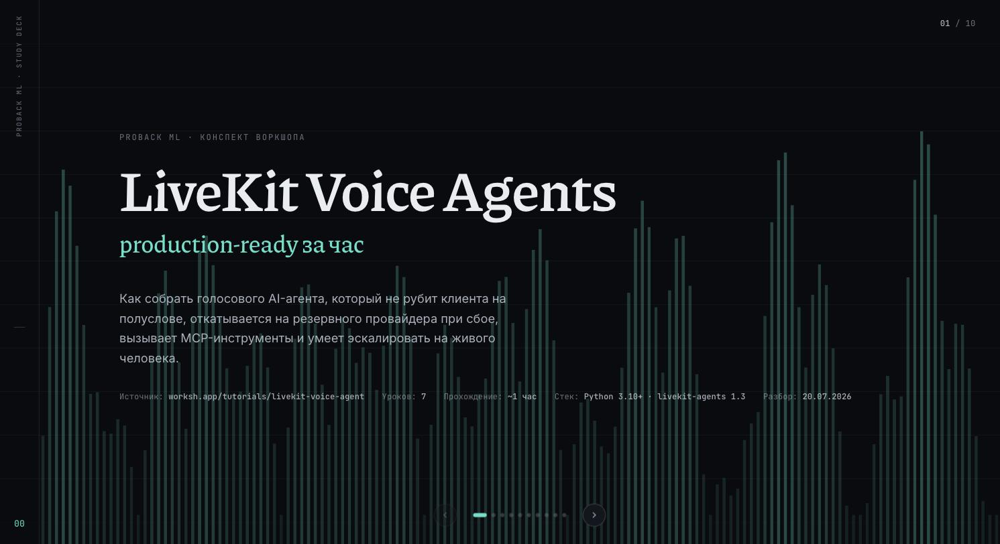

# livekit-deepdive

Учебный проект по [воркшопу LiveKit Agents](https://worksh.app/tutorials/livekit-voice-agent/introduction): голосовой AI-агент (VAD → STT → LLM → TTS), три конфигурации для сравнения провайдеров и разбор трассировки в Langfuse. Образовательный контент, не привязан к конкретному клиенту или продукту.

## Материалы

- Полный конспект по всем 7 урокам: [`materials/livekit-voice-agent-guide.html`](<materials/livekit-voice-agent-guide.html>)
- Слайд-дека для показа команде (10 экранов: конспект + отдельный слайд с тремя протестированными конфигурациями, навигация стрелками/точками): [`materials/livekit-voice-agent-deck.html`](<materials/livekit-voice-agent-deck.html>) — открывать прямо в браузере (двойной клик / `open`), онлайн-версия: https://claude.ai/code/artifact/20253987-48db-48e1-b3cc-cc9c2a507400

  [](<materials/livekit-voice-agent-deck.html>)

## Структура репозитория

```
agent.py       базовый агент из туториала (= stage 1, EN)
stages/        три конфигурации STT/LLM/TTS для сравнения (см. ниже)
tracing.py     Langfuse-трейсинг голосового пайплайна
materials/     исходные материалы курса
```

## Установка

```bash
uv sync
uv run agent.py download-files   # один раз — модели VAD и turn-detector
```

`.env` должен содержать как минимум:

```
LIVEKIT_URL=wss://your-project.livekit.cloud
LIVEKIT_API_KEY=...
LIVEKIT_API_SECRET=...
```

## Три этапа тестирования

### Stage 1 — английский, всё через LiveKit Inference

```bash
uv run stages/stage1_en_livekit.py console
```

STT `assemblyai/universal-streaming:en` · LLM `openai/gpt-4.1-mini` · TTS `cartesia/sonic-3`. Работает на текущих кредах без доп. настройки — проверено (агент поднимается и коннектится к inference gateway).

### Stage 2 — русский, всё ещё через LiveKit Inference

```bash
uv run stages/stage2_ru_livekit.py console
```

STT `deepgram/nova-3` (`language="ru"`) · LLM `openai/gpt-4.1-mini` · TTS `elevenlabs/eleven_turbo_v2_5` (`language="ru"`, voice — пример из документации LiveKit, замените на голос по вкусу). Тоже работает на текущих кредах — проверено запуском, доп. ключи не нужны.

**Semantic turn detection для русского.** `MultilingualModel` официально поддерживает русский (наряду с EN/ES/FR/DE/IT/PT/NL/ZH/JA/KO/ID/TR/HI — подтверждено документацией LiveKit). Живого прогона с микрофоном не было — в этой среде нет аудио-устройства. Демо для команды:

1. `uv run stages/stage2_ru_livekit.py console`
2. Сказать в микрофон незаконченную фразу с явной паузой-заполнителем: «Мне нужно узнать про... э-э... баланс на счету»
3. Ожидаемо: агент не перебивает на паузе, ждёт конца мысли
4. Для контраста можно временно убрать `turn_detection=MultilingualModel()` из stage2 и повторить — агент должен начать перебивать раньше

### Stage 3 — русский, LLM с открытыми весами через OpenRouter (путь на on-prem)

```bash
uv run stages/stage3_ru_openrouter.py console
```

STT/TTS — те же, что в stage 2 (через LiveKit Inference). LLM — `openai.LLM.with_openrouter(model="qwen/qwen-2.5-72b-instruct")`: открытые веса, хорошее качество на русском; тот же OpenAI-совместимый клиент позже можно перенаправить на self-hosted vLLM/TGI без переписи остального пайплайна.

Требует `OPENROUTER_API_KEY` в `.env` (ключ — https://openrouter.ai/keys); сейчас его там нет. Без ключа скрипт сразу и понятно останавливается с подсказкой, а не падает глубоким стектрейсом — проверено. Модель переопределяется через `OPENROUTER_MODEL`, если точный slug на openrouter.ai/models к моменту запуска изменится.

## Langfuse-трассировка

Трассировка голосового пайплайна в Langfuse возможна, реализована в `tracing.py` и подключена в stage 2/3 — no-op, если `LANGFUSE_PUBLIC_KEY`/`LANGFUSE_SECRET_KEY` не заданы (сейчас их нет в `.env`, живьём не гонял).

Модель: один звонок = один Langfuse `session_id`, каждая реплика (turn) = отдельный `trace` — прямое применение собственного правила гайда («один запрос пользователя = один trace»), просто для голосовых реплик, а не текстовых.

**Нужно ли расширять гайд под язык и звук — да, в трёх местах:**

1. В гайде нет типа узла для STT/TTS-вызовов — это не `generation` в его терминах (нет LLM/VLM), но у STT/TTS есть реальная юнит-экономика (секунды аудио, $). Сейчас это логируется как `span` с именем вида `<turn>-stt`/`<turn>-tts` — рабочий обход, но не первоклассная поддержка.
2. Итог turn-detection (агент подождал или перебил, сколько заняло решение) — гайд такую метрику вообще не рассматривает, а это ровно то число, которое отвечает на вопрос «работает ли semantic turn detection на русском» по реальным звонкам, а не по одной демке.
3. Гайд написан под синхронные вызовы функций (`@observe()` вокруг тела функции). `AgentSession` — событийная модель (`conversation_item_added`, `session_usage_updated`), для неё нужен отдельный раздел о трассировке из колбэков.

Отдельно: установленный LiveKit Agents 1.6 уже депрекейтнул `metrics_collected` (то, что описано в уроке 5 конспекта) в пользу `conversation_item_added` + `session_usage_updated`. Из-за этого честный предел текущей реализации: она получает текст реплики и что даёт `ChatMessage.metrics` на уровне turn, отдельно — суммарные provider/model/duration/tokens, но не чистый STT→LLM→TTS waterfall по каждой реплике, как в уроке 5. Подробнее — в докстринге `tracing.py`.


## Не сделано / открытые вопросы

- Реального голосового прогона (спросить агента вслух) не было — в этой среде нет микрофона; все три stage проверены только на уровне «поднимается, коннектится к провайдерам, не падает».
- ElevenLabs voice ID в stage 2/3 — пример из документации LiveKit, не отобран по качеству звучания на русском.
- `OPENROUTER_API_KEY` и `LANGFUSE_PUBLIC_KEY`/`LANGFUSE_SECRET_KEY` отсутствуют в `.env` — без них stage 3 и живая Langfuse-трассировка не заработают.
